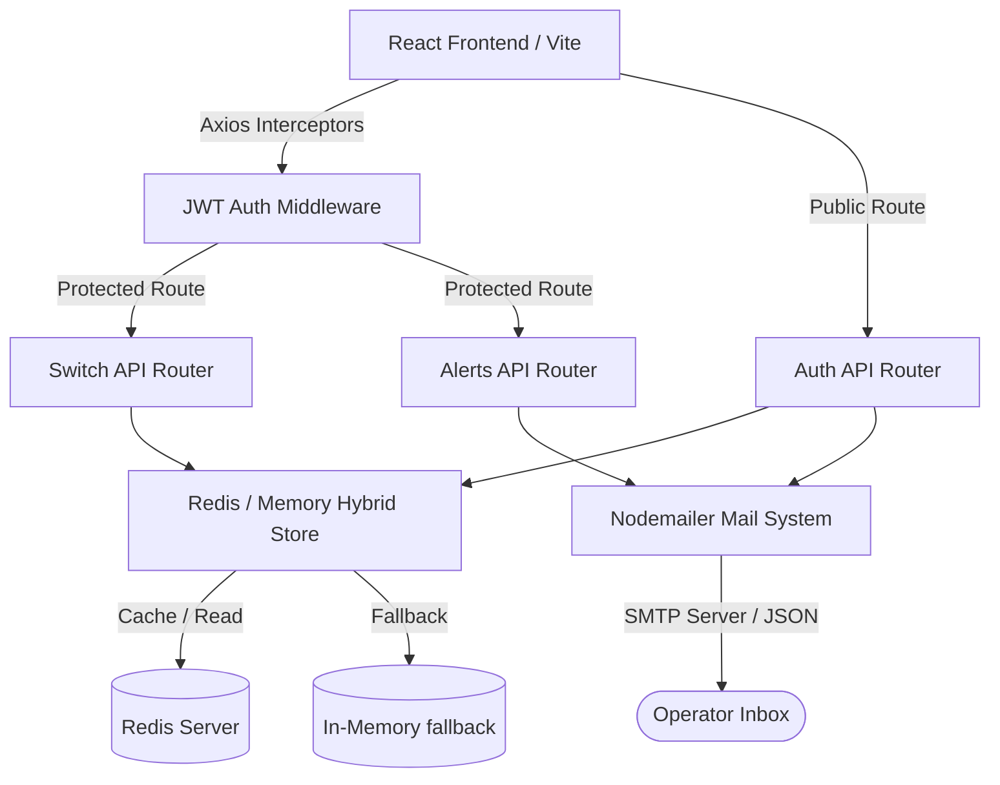

# NetPulse Full-Stack Dashboard

An enterprise-grade, professional NOC (Network Operations Center) monitoring and management platform. This project features a full-stack architecture powered by React 19, Vite 8, Express 5, and Redis 5, incorporating telemetry graphing, interactive network switch inventory control, modular JWT authentication, automated mail flows (via Nodemailer), and a highly polished custom UI/UX design.

---

## 📖 Table of Contents

1. [Key Features](#-key-features)
2. [Technology Stack](#-technology-stack)
3. [Architecture & Flow](#-architecture--flow)
4. [Project Structure](#-project-structure)
5. [Getting Started](#-getting-started)
   - [Prerequisites](#prerequisites)
   - [Installation](#installation)
   - [Environment Configuration](#environment-configuration)
   - [Running the Application](#running-the-application)
6. [API Reference](#-api-reference)
   - [Authentication Endpoints](#authentication-endpoints)
   - [Switch Inventory Endpoints](#switch-inventory-endpoints)
   - [Telemetry & Alerts](#telemetry--alerts)
7. [Design System & UI](#-design-system--ui)
8. [Linting & Code Quality](#-linting--code-quality)

---

## 🌟 Key Features

* **🌐 Network Switch Inventory (CRUD)**: Manage networking switches in real-time. Operators can add, update, delete, and view switches, featuring physical rack location descriptors, active/maintenance/inactive statuses, and configuration profiles.
* **📈 Multi-Metric Telemetry Charting**: Visualizes critical network data (Minimum, Median, and Maximum metrics) over a rolling 24-hour window using Chart.js.
  * **Point Inspection**: Double-click any data point on the chart to lock focus and load telemetry specs into a detail inspector panel.
  * **CSV Export**: Export time-series data instantly to a CSV file.
* **🔒 Enterprise Security & Auth**: Full user authorization cycle including Secure Registration, JWT Login, and password recovery.
  * **Secure Sessions**: Token-based auth stored securely with client-side Axios request-interceptors.
  * **Auth Expiration**: Automatically clears invalid sessions and redirects users on HTTP `401 Unauthorized` responses.
* **⚡ Non-Blocking Email Dispatch**: Welcome, password reset, and simulated cluster warning emails are handled asynchronously (fire-and-forget promise chains) so they never block the client UI.
* **🚀 Resend HTTP API Fallback**: Supports Resend HTTPS API (`https://api.resend.com`) as a fallback to bypass SMTP port blocking (port 465/587) in hosted firewalled environments like Render Free Tier.
* **💾 Hybrid Storage Engine**: Automatically utilizes a Redis database when configured, dynamically falling back to local storage if Redis is unreachable.
* **🎨 Dark/Light NOC Interface**: Polished UI utilizing custom HSL color tokens, transitions, and micro-interactions, complete with a clean light-themed marketing landing page.

---

## 🛠️ Technology Stack

### Frontend
* **Core Framework**: React 19 & React DOM 19
* **Build Tooling**: Vite 8 (Hot Module Replacement)
* **Routing**: React Router v7
* **Data Visualization**: Chart.js 4 & React-Chartjs-2
* **Icons**: Lucide React
* **Styling**: Vanilla CSS variables with custom enterprise themes

### Backend
* **Server Framework**: Express 5 (Asynchronous routing support)
* **Caching & Database**: Redis 5 (Node-Redis client)
* **Authentication**: JSON Web Tokens (JWT) & Bcrypt.js (Password hashing)
* **Email System**: Nodemailer (SMTP transports & HTML templating) & Resend HTTPS REST API fallback


---

## 🔄 Architecture & Flow



1. **Client Request**: Axios automatically appends the `Authorization: Bearer <token>` header from `localStorage` using request interceptors.
2. **Server Middleware**: The backend intercepts requests using `requireAuth` middleware to decode and verify JWT signatures.
3. **Hybrid Storage**: The custom `store.js` wrapper queries the local Redis instance. If the connection fails, it switches to in-memory state keeping the server responsive and active.
4. **Email Automation**: SMTP mailers handle signups (welcome emails), alerts (simulated crashes), and tokenized password resets (1-hour expiry).

---

## 📂 Project Structure

```text
├── backend/
│   ├── email/              # Email templates & nodemailer transporter setup
│   ├── middleware/         # Express middlewares (JWT auth verification)
│   ├── redis/              # Redis client connection and store fallback logic
│   ├── routes/             # API routers (auth, switches, charts, alerts)
│   ├── app.js              # Express app setup and middleware configuration
│   └── server.js           # Main application entry point
├── src/
│   ├── assets/             # Images and static design assets
│   ├── components/         # Reusable UI widgets (Header, Sidebar, Modals, Cards)
│   ├── context/            # React contexts (AuthContext, ToastContext)
│   ├── hooks/              # Custom React hooks (e.g., useDocumentTitle)
│   ├── pages/              # Primary views (Dashboard, Switches, Charts, Auth Pages)
│   ├── routes/             # Route configurations and ProtectedRoute controller
│   ├── services/           # Backend API network service integrations (Axios)
│   ├── utils/              # Client-side helper functions & text formatters
│   ├── App.css             # Main styling rules and layout wrappers
│   ├── App.jsx             # Top-level routes definition
│   ├── index.css           # Global typography, resets, CSS variables
│   └── main.jsx            # React root injection point
├── .env.example            # Configuration boilerplate
├── package.json            # Node dependencies and scripts
└── vite.config.js          # Vite custom compiler rules
```

---

## 🚀 Getting Started

### Prerequisites
* **Node.js**: `v18.x` or higher
* **npm**: `v9.x` or higher
* **Redis** (Optional but highly recommended): `v6.x` or higher running on default port `6379`.

### Installation
Clone the project repository, navigate into the directory, and run:
```bash
npm install
```

### Environment Configuration
Copy the `.env.example` file to create your local configurations:
```bash
cp .env.example .env
```
Open `.env` and fill in the values:

| Key | Description | Default |
| :--- | :--- | :--- |
| `PORT` | Backend server port | `5000` |
| `CLIENT_ORIGIN` | Allowed client URL for CORS | `http://localhost:5173` |
| `FRONTEND_URL` | Application client URL (password resets) | `http://localhost:5173` |
| `VITE_API_URL` | Frontend connection URL to backend API | `http://localhost:5000` |
| `JWT_SECRET` | Secret key for encoding token payloads | `replace-with-a-long-random-secret` |
| `REDIS_URL` | Connection URL for Redis instances | `redis://127.0.0.1:6379` |
| `SMTP_HOST` | Host address of your outgoing mail server | *Optional* |
| `SMTP_PORT` | Port number of your outgoing mail server | `587` |
| `SMTP_USER` | SMTP credentials username | *Optional* |
| `SMTP_PASS` | SMTP credentials password | *Optional* |
| `EMAIL_FROM` | Sender display name & address for SMTP | `NetPulse Dashboard <no-reply@netpulse.local>` |
| `ALERT_EMAIL_TO` | Target recipient for cluster notifications | *Optional (Falls back to auth operator)* |
| `RESEND_API_KEY` | Resend API token for bypassing blocked SMTP ports | *Optional (Bypasses SMTP if present)* |
| `EMAIL_FROM_HTTP` | Sender email address for Resend HTTP calls | `onboarding@resend.dev` |

*Note: If no SMTP details or RESEND_API_KEY are supplied, the mailer automatically falls back to an output-logging `jsonTransport`, meaning emails will print directly to the server terminal console for easy local debugging.*

### Running the Application

* **Start Redis Server**:
  ```bash
  redis-server
  ```
* **Run full stack concurrently** (Starts both frontend and backend):
  ```bash
  npm run dev:full
  ```
* **Run frontend client only**:
  ```bash
  npm run dev
  ```
* **Run backend server only**:
  ```bash
  npm run server
  ```
* **Compile production build**:
  ```bash
  npm run build
  ```

---

## 🌍 Deployment

### Backend on Render

Deploy the repository as a Render web service using the root of this project.

* **Build command**: `npm install`
* **Start command**: `npm run server`
* **Health check**: `/health`
* **Required environment variables**:
  * `JWT_SECRET`
  * `REDIS_URL`
  * `PORT` is provided automatically by Render
  * `CLIENT_ORIGIN` set to your Vercel app URL
  * `FRONTEND_URL` set to your Vercel app URL
  * `SMTP_HOST`, `SMTP_PORT`, `SMTP_USER`, `SMTP_PASS`, `EMAIL_FROM`, `ALERT_EMAIL_TO` if email delivery is enabled

If you use the included [render.yaml](render.yaml), Render can import the service configuration directly from the repo.

### Frontend on Vercel

Deploy the same repository as a Vercel project with the project root set to this folder.

* **Build command**: `npm run build`
* **Output directory**: `dist`
* **Environment variable**: `VITE_API_URL` set to the Render backend URL

The included [vercel.json](vercel.json) keeps React Router routes working by rewriting all client-side paths to `index.html`.

### Recommended URL Setup

* Render backend URL example: `https://netpulse-backend.onrender.com`
* Vercel frontend URL example: `https://netpulse-dashboard.vercel.app`
* `VITE_API_URL` on Vercel: `https://netpulse-backend.onrender.com`
* `CLIENT_ORIGIN` and `FRONTEND_URL` on Render: `https://netpulse-dashboard.vercel.app`

---

## 🔌 API Reference

### Authentication Endpoints

#### `POST /register`
Creates a new operator account and returns a session JWT token.
* **Payload**:
  ```json
  {
    "name": "Operator Name",
    "email": "operator@netpulse.local",
    "password": "strongpassword123"
  }
  ```

#### `POST /login`
Authenticates credentials and issues a JWT token.
* **Payload**:
  ```json
  {
    "email": "operator@netpulse.local",
    "password": "strongpassword123"
  }
  ```

#### `POST /forgot-password`
Initiates password recovery email carrying a unique validation token.
* **Payload**:
  ```json
  {
    "email": "operator@netpulse.local"
  }
  ```

#### `POST /reset-password`
Uses token code from email to change account password.
* **Payload**:
  ```json
  {
    "email": "operator@netpulse.local",
    "token": "reset-uuid-token",
    "password": "newsecurepassword123"
  }
  ```

---

### Switch Inventory Endpoints
*(All Switch endpoints require verification authorization header: `Authorization: Bearer <token>`)*

#### `GET /switches`
Retrieves list of all registered switch devices.

#### `POST /switches`
Registers a new switch to the system inventory.
* **Payload**:
  ```json
  {
    "id": "SW-1005",
    "model": "Cisco Catalyst 3850",
    "physicalDevice": "Rack E / Unit 02",
    "config": "Template configuration",
    "status": "Active"
  }
  ```

#### `PUT /switches/:id`
Updates settings/configuration/status on a target switch.
* **Payload**:
  ```json
  {
    "model": "Cisco Catalyst 3850 v2",
    "status": "Maintenance"
  }
  ```

#### `DELETE /switches/:id`
Deletes a switch from the repository.

---

### Telemetry & Alerts

#### `GET /chart-data`
*(Requires Auth)* Retrieves the hourly network statistics dataset for the last 24 hours.

#### `POST /cluster-alert`
*(Requires Auth)* Sends a critical cluster warning email template immediately via Nodemailer SMTP or Resend API.
* **Payload**:
  ```json
  {
    "severity": "High",
    "message": "Simulated hardware fault in cluster node A.",
    "recipientEmail": "ops-alerts@netpulse.local"
  }
  ```

#### `GET /debug-mailer`
*(Public)* Performs dynamic diagnostics on the SMTP transporter verification state and details the status of any Resend HTTP API configurations. Returns precise socket error reports (e.g. `ETIMEDOUT`) to identify network restrictions.

---

## 🎨 Design System & UI

The platform uses a custom corporate design system based around **NOC (Network Operations Center)** themes:
* **Glassmorphic Elements**: Modern cards (`.noc-card`) featuring clean borders, high-contrast spacing, and custom grid systems.
* **Adaptive Status Badges**: Unified pill badges representing active/maintenance/inactive statuses with corresponding tones.
* **Light-Themed Landing Page**: A fully responsive landing page utilizing a clean white and light blue-grey design (`#edf2f9`) with soft gradients and radial glow patterns, matching the dashboard's light theme. Features a terminal simulation deck showcasing network logs.
* **4-Column Corporate Footer**: An enterprise footer structure featuring organized columns for Platform services, developer Resources, and legal Compliance links.
* **Micro-Animations**: Hover animations on clickable elements, cards, and list rows to provide instant visual feedback.

---

## 🛡️ Linting & Code Quality

This project enforces strict formatting guidelines and leverages **Oxlint** for lightning-fast analysis. To test files for code quality issues, execute:
```bash
npm run lint
```
